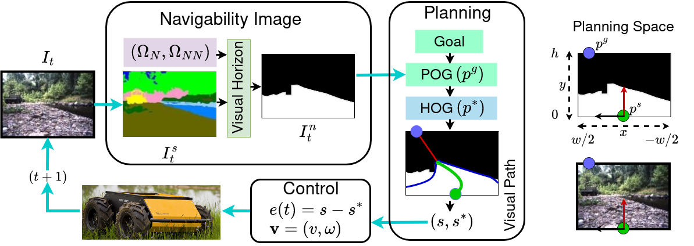
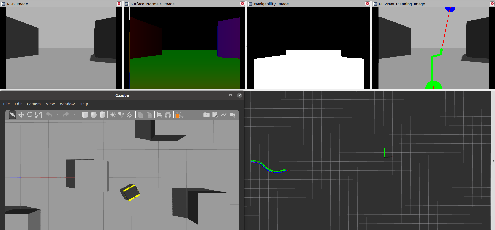
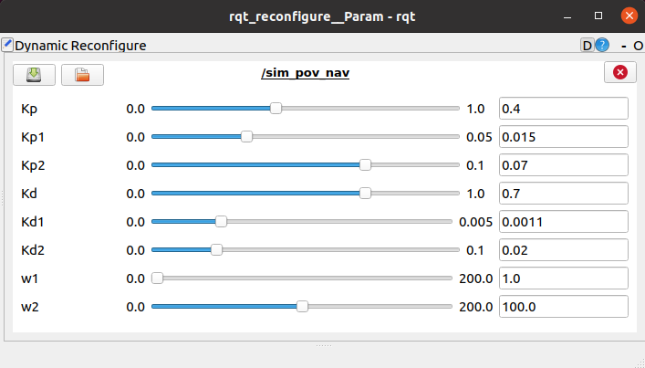

# POVNav: A Pareto-Optimal Mapless Visual Navigator

POVNav is a planning and control framework that uses a novel image-based local representation of the environment using existing image segmentation methods, to navigate a robot to the specified goal point or direction using only a monocular camera without relying on a map. Apart from the collision-free motion, it also shows selective navigation behavior (such as ``Do not walk on the grass!'') which is not possible with the occupancy grid representation. 
The navigation task is formulated as a visual servoing problem where the robot is able to directly generate efficient motion according to the visual features representing the navigability. The navigability is represented as a binary image generated from existing segmentation techniques, making it a handy plug-and-play suite for any segmentation method.



## This paper has been accepted for publication in ISER 2023.

### Cite as :

```bibtex
@article{pushp2023povnav,
  title = {POVNav: A Pareto-Optimal Mapless Visual Navigator},
  author = {Durgakant Pushp and Zheng Chen and Chaomin Luo and Jason M. Gregory and Lantao Liu},
  journal = {arXiv},
  year = {2023},
  eprint = {2310.14065},
  archivePrefix = {arXiv},
  primaryClass = {cs.RO},
}

## Requirements
- Any robot simulator that provides the control of it's linear and angular velocities (`v, w`), e.g. Jackal, Husky, Turtlebot e.t.c. 
Use the following instruction to setup Jackal simulator: `sudo apt-get install ros-<distro>-jackal-simulator ros-<distro>-jackal-desktop ros-<distro>-jackal-navigation`.
- Image Segmentation Method: Use any segmetation method of your choice, define the nevigabiliy vector and prodice binary segmentation image such that navigable segments gets a value `'255'` non-navigable gets `'0'`.

### Required ROS topics
| Subscribe            | Description                                                                                                   |        Example      |
| -------------------- | ------------------------------------------------------------------------------------------------------------- | :-----------------------: |
| ~odom_topic     | name of topic that provides the robot's state.                          | "/odom"            
| ~binary_segmented_image               | name of the topic that provides the binary segmeted image based on the defined navigability.                    |              "/ground_segmentation"            |

- It publishes linear and angular velocities to the "`/cmd_vel`" topic.

# Setup
## Install and run the dependencies
- Launch the jackal simulator (or any other UGV sumulator) with realsence camera on it. Verify that you are able to subscribe to the above mentioned topics.
```
export JACKAL_URDF_EXTRAS=/path_to_src/camera_urdf/realsense.urdf.xacro
roslaunch jackal_gazebo empty_world.launch 
```


- Setup segmentation module from [depth2surface_normals_seg](https://github.com/Dpushp/depth2surface_normals_seg). Alternatively, you can run any image segmentation algoritms and implement *Visual Horizon*. Launch the segmentation node.

## Setup `POVNav` repository
### How to Build
Clone and build the repository to your workspace. 
```
mkdir catkin_ws/src -p
cd catkin_ws/src
```
```
git clone https://github.com/Dpushp/POVNav.git
```
```
cd ..
catkin_make
```

### Lanuch the sim_pov_nav node
```
roslaunch roslaunch pov_nav sim_pov_nav.launch 
```
### Open rviz to visualise the topics and give goal to the robot
```
rosrun rviz rviz -d path_to_pov_nav_src/rviz/pov_nav_viz.rviz
```


Robot will navigate to the goal given from rviz.

## Parameters Tuning
Run Dynamic Recongigure to change the parameters.
```
rosrun rqt_reconfigure rqt_reconfigure
```


